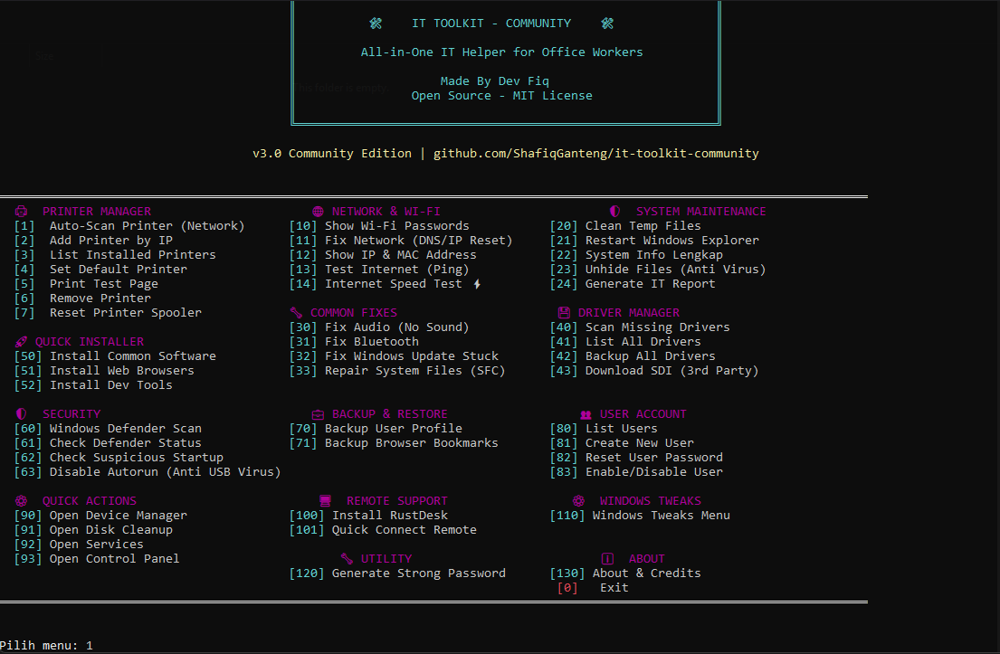
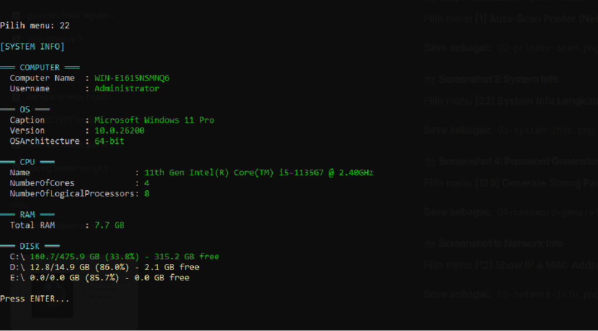
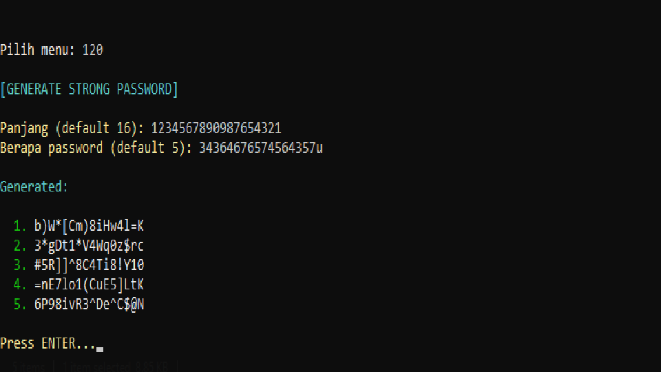
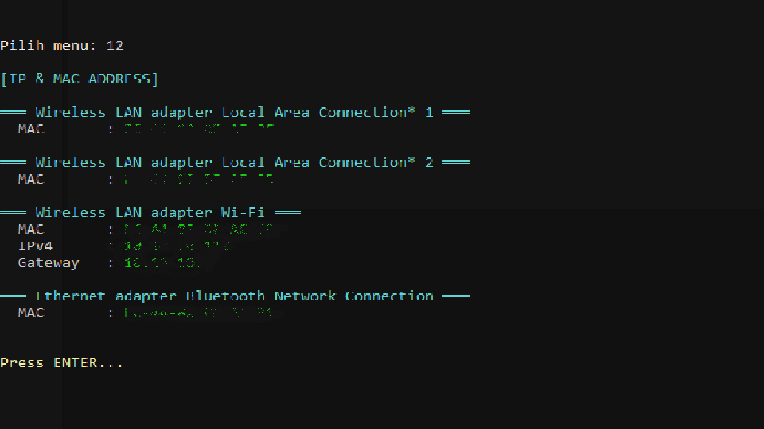

# 🛠️ IT Toolkit - Community Edition


**All-in-One IT Helper Tool for Office Workers** - Open source, free, and powerful!

Made with ❤️ by **Dev Zatrac** ([@ShafiqGanteng](https://github.com/ShafiqGanteng))

---

## 🎯 Why This Tool?

As an IT support staff (or anyone who helps with office IT problems), you often face:
- 🖨️ Printer suddenly stops working
- 📶 Need to share Wi-Fi password to guests
- 🐌 Laptop becomes slow due to temp files
- 👻 Files hidden by virus shortcuts (USB flashdisk)
- 🔊 Audio not working after sleep mode
- 💾 Need to backup user profile before reinstall

**This toolkit solves all of those problems in one place!**

---

## ✨ Features (35+ tools!)

### 🖨️ Printer Manager
- **Auto-scan printer di network** (with device name detection!)
- Add printer by IP
- List/Set Default/Remove printer
- Print test page
- Reset printer spooler (fix stuck printer)

### 🌐 Network & Wi-Fi
- Show saved Wi-Fi passwords
- Fix network issues (DNS/IP reset)
- Show IP & MAC address
- Test internet (ping)
- Internet speed test

### 🛡️ System Maintenance
- Clean temp files (free up storage)
- Restart Windows Explorer
- System info lengkap (CPU, RAM, GPU, Disk)
- **Unhide files** (anti virus shortcut on USB!)
- Generate IT report

### 🔧 Common Fixes
- Fix audio (no sound)
- Fix bluetooth
- Fix Windows Update stuck
- Repair system files (SFC)

### 💾 Driver Manager
- Scan missing drivers
- List all drivers
- Backup all drivers
- Download Snappy Driver Installer

### 🚀 Quick Installer (via WinGet)
- Install common software (Chrome, VLC, 7-Zip, etc.)
- Install web browsers
- Install dev tools

### 🛡️ Security
- Windows Defender scan
- Check Defender status
- Check suspicious startup programs
- Disable autorun (anti USB virus)

### 💼 Backup & Restore
- Backup user profile (Documents, Desktop, Downloads, Pictures)
- Backup browser bookmarks (Chrome, Brave, Edge, Firefox)

### 👥 User Account Management
- List all user accounts
- Create new user
- Reset user password
- Enable/disable user

### 🖥️ Remote Support
- Install RustDesk (free remote desktop)
- Quick connect to remote PC

### ⚙️ Windows Tweaks
- Show file extensions
- Show hidden files
- Disable Bing search
- Disable telemetry (privacy)
- Enable Ultimate Performance mode

### ⚙️ Quick Actions
- Open Device Manager
- Open Disk Cleanup
- Open Services
- Open Control Panel

### 🔧 Utility
- Generate strong password

---

## 📋 Requirements

- **Windows 10/11** (64-bit recommended)
- **Python 3.10+** (if running from source)
- **Administrator privileges** (required for most features)
- **Internet connection** (for some features)

---

## 🚀 Installation & Usage

### Option 1: Run from Source

```bash
# Clone repository
git clone https://github.com/ShafiqGanteng/it-toolkit-community.git
cd it-toolkit-community

# Run
python main.py
```

### Option 2: Build to .EXE (Portable)

```bash
# Install PyInstaller
pip install pyinstaller

# Build
pyinstaller --onefile --uac-admin --name "ITToolkitCommunity" --console main.py

# Output: dist/ITToolkitCommunity.exe
```

---

## 📁 Project Structure

```
it-toolkit-community/
├── main.py                    # Entry point
├── colors.py                  # ANSI color codes
├── config.py                  # Settings & constants
├── menu.py                    # Banner, status, menu
├── printer.py                 # Printer manager
├── network.py                 # Network & Wi-Fi
├── system_maintenance.py      # System maintenance
├── fixes.py                   # Common fixes
├── installer.py               # Software installer (WinGet)
├── quick_actions.py           # Quick actions
├── utility.py                 # Utility functions
├── drivers.py                 # Driver manager
├── security.py                # Antivirus & security
├── users.py                   # User account management
├── backup.py                  # Backup & restore
├── tweaks.py                  # Registry tweaks
└── remote.py                  # Remote support
```

---

## 📸 Screenshots

### 🎨 Main Menu
*All-in-one interface with categorized features*



---

### 🖨️ Auto-Scan Network Printers
*Automatically detect printers with device name resolution*



---

### 📊 System Information
*Complete hardware & OS details at a glance*


---

### 🔐 Password Generator
*Generate strong passwords instantly*



---

### 🌐 Network Information
*View IP, MAC address, and network adapters*



---

## 🎯 Common Use Cases

### Setup New Employee's Laptop
1. Run `[1] Auto-Scan Printer` → add office printer
2. Run `[50] Install Common Software` → install all essential apps
3. Run `[110] Windows Tweaks Menu` → optimize Windows
4. Run `[24] Generate IT Report` → for IT inventory

### Daily Office IT Support
- **"My printer error!"** → `[7] Reset Printer Spooler` ✅
- **"My USB files are gone!"** → `[23] Unhide Files` ✅
- **"Forgot Wi-Fi password!"** → `[10] Show Wi-Fi Passwords` ✅
- **"No audio!"** → `[30] Fix Audio` ✅
- **"Internet slow!"** → `[14] Internet Speed Test` + `[11] Fix Network` ✅

### Migration to New Laptop
1. **Old laptop:** Run `[70] Backup User Profile` to external drive
2. **New laptop:** Restore manually + use this toolkit for setup

---

## 🤝 Contributing

Contributions are welcome! Here's how:

1. Fork the repository
2. Create your feature branch (`git checkout -b feature/AmazingFeature`)
3. Commit changes (`git commit -m 'Add amazing feature'`)
4. Push to branch (`git push origin feature/AmazingFeature`)
5. Open a Pull Request

**Found a bug?** [Open an issue](https://github.com/ShafiqGanteng/it-toolkit-community/issues)!

---

## 🗺️ Roadmap

- [ ] GUI version (using tkinter or PyQt)
- [ ] Multi-language support (English, Indonesian)
- [ ] More tweaks and fixes
- [ ] Integration with more tools (Ninite, Chocolatey)
- [ ] Web-based dashboard
- [ ] Mobile companion app

---

## ⚠️ Disclaimer

This tool is provided **as-is** for educational and personal use.

- Use at your own risk
- Test on non-production systems first
- Not affiliated with Microsoft or any vendor
- Author is not responsible for any damage

---

## 📜 License

This project is licensed under the **MIT License** - see [LICENSE](LICENSE) file for details.

You are free to:
- ✅ Use commercially
- ✅ Modify
- ✅ Distribute
- ✅ Private use

---

## 🌟 Show Your Support

If this tool helps you in your daily IT work, please:

- ⭐ **Star this repository** on GitHub
- 🍴 **Fork** and customize for your needs
- 📢 **Share** with colleagues
- 💬 **Submit feedback** via issues

---

## 👤 Author

**Dev Zatrac** - OB (Office Boy) turned Python Developer 💪

- GitHub: [@ShafiqGanteng](https://github.com/ShafiqGanteng)

---

## 🙏 Acknowledgments

- **Snappy Driver Installer** - for driver database
- **RustDesk** - for remote desktop functionality
- **WinGet** - for software installation
- **Python community** - for amazing libraries

---

## 📊 Stats


---

**Made with ❤️ in Indonesia 🇮🇩**